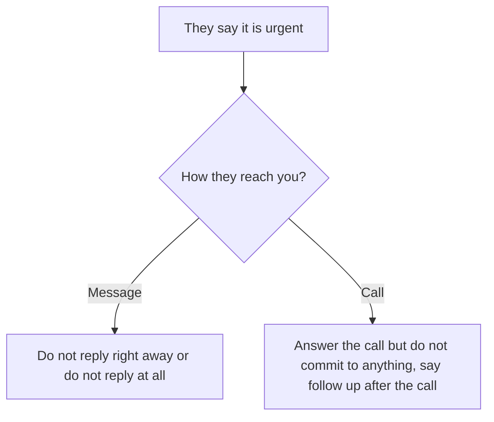
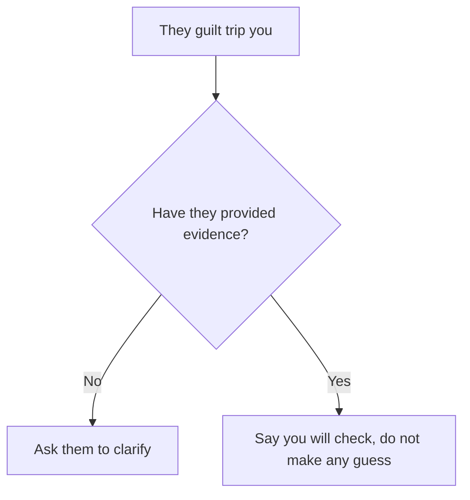
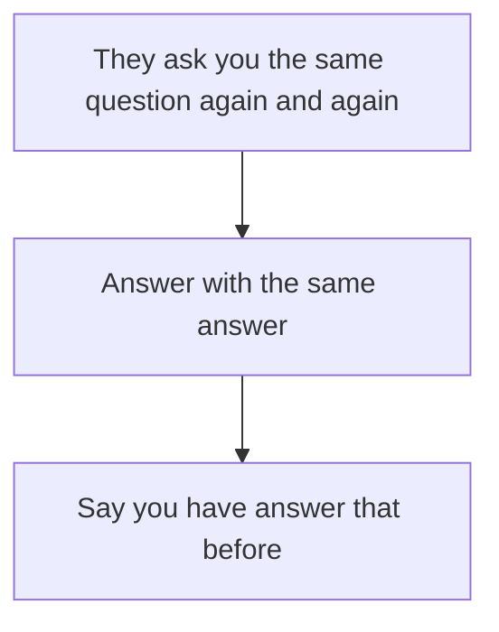
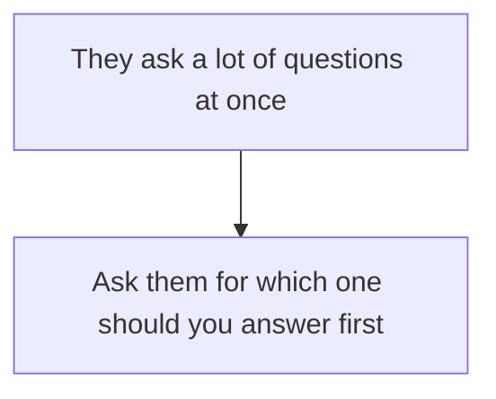
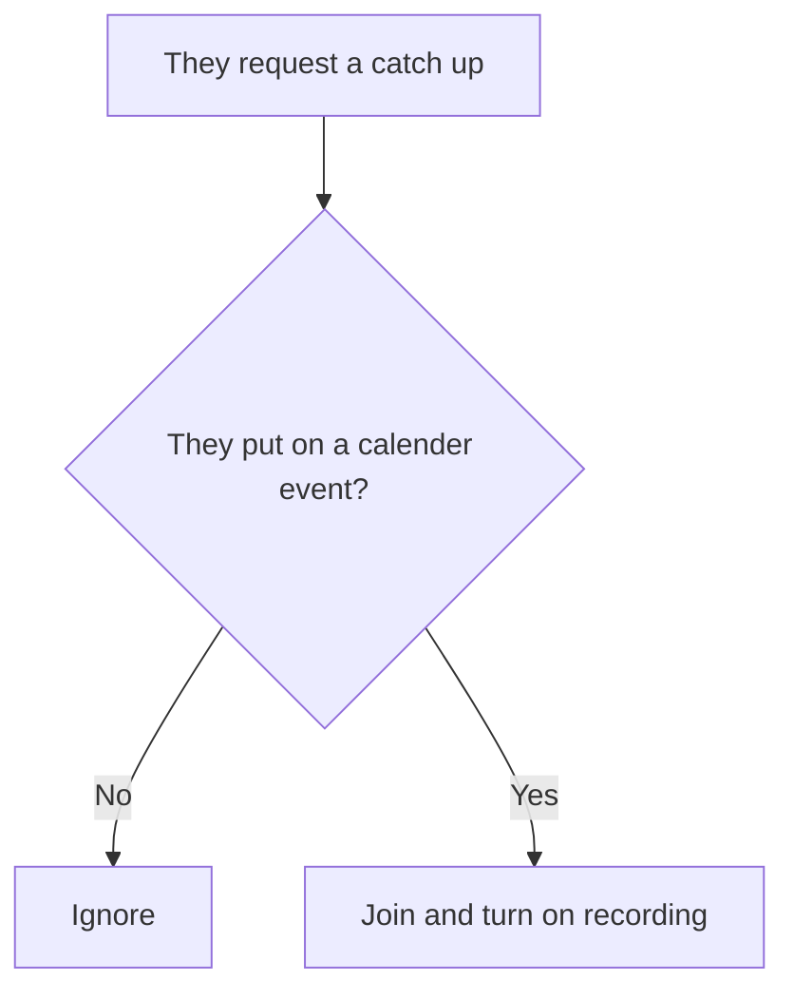
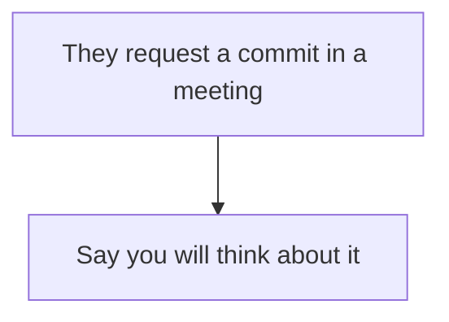
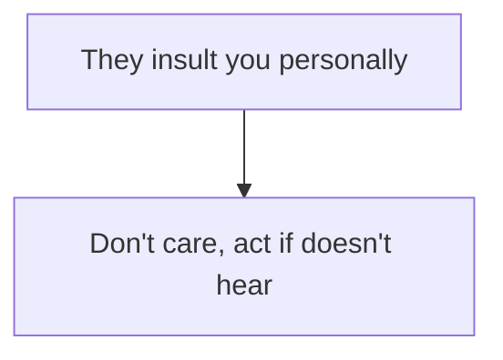
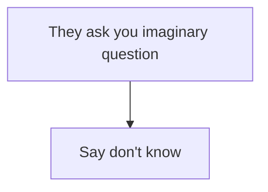
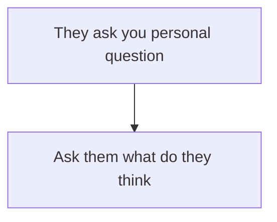
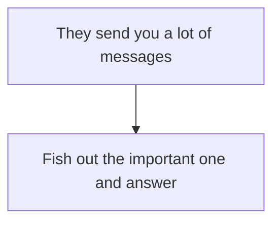

> [!WARNING]
> Only use the following to a toxic person

In any situation, do not apologize, do not explain yourself
# Urgent

# Guilt trip

# Asking the same question

# Asking a lot of questions

# Catch up

# Commit

# Insult

# Imaginary question

# Personal question

# Message bombing

